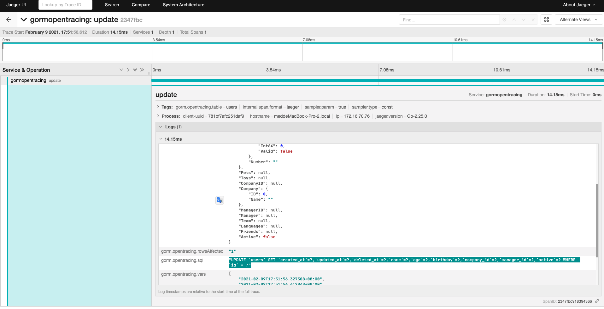
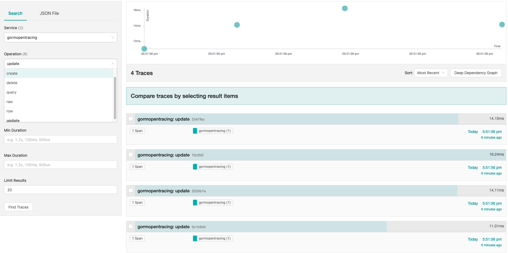

# gorm-opentracing

[](https://goreportcard.com/report/github.com/go-gorm/opentracing) [](https://pkg.go.dev/gorm.io/plugin/opentracing)

opentracing support for gorm2.

### Features

- [x] Record `SQL` in `span` logs.
- [x] Record `Result` in `span` logs.
- [x] Record `Table` in `span` tags.
- [x] Record `Error` in `span` tags and logs.
- [x] Register `Create` `Query` `Delete` `Update` `Row` `Raw` tracing callbacks. 

### Get Started

I assume that you already have an opentracing Tracer client started in your project.

```go
import (
        ....
	gormopentracing "gorm.io/plugin/opentracing"
)
func main() {
	var db *gorm.DB
	
	db.Use(gormopentracing.New())
	
	// if you want to use customized tracer instead of opentracing.GlobalTracer() which is default,
	// you can use the option WithTracer(yourTracer)
}
```

Otherwise, you need to deploy distributed tracing server(jaeger, zipkin for example), then
you need to boot tracer client in yours project and set tracer to opentracing.

```go
import (
	"github.com/opentracing/opentracing-go"
	"github.com/uber/jaeger-client-go"
	"github.com/uber/jaeger-client-go/config"
	jaegerlog "github.com/uber/jaeger-client-go/log"
)

func bootTracerBasedJaeger() {
	// jaeger tracer configuration
	cfg := &config.Configuration{
		Sampler: &config.SamplerConfig{
			Type:  jaeger.SamplerTypeConst,
			Param: 1,
		},
		ServiceName: "gormopentracing",
		Reporter: &config.ReporterConfig{
			LogSpans: true,
			//LocalAgentHostPort:  "127.0.0.1:6381",
			BufferFlushInterval: 100 * time.Millisecond,
			CollectorEndpoint:   "http://127.0.0.1:14268/api/traces",
		},
	}

	// jaeger tracer client 
	tracer, _, err := cfg.NewTracer(
		config.Logger(jaegerlog.StdLogger),
		config.ZipkinSharedRPCSpan(true),
	)
	if err != nil {
		log.Printf("failed to use jaeger tracer plugin, got error %v", err)
		os.Exit(1)
	}
	
	// set into opentracing's global tracer, so the plugin would take it as default tracer.
	opentracing.SetGlobalTracer(tracer)
}
```

### Plugin options

```go
// WithLogResult log result into span log, default: disabled.
func WithLogResult(logResult bool)

// WithTracer allows to use customized tracer rather than the global one only.
func WithTracer(tracer opentracing.Tracer)

// WithSqlParameters is a switch to control that whether record parameters in sql or not.  
func WithSqlParameters(logSqlParameters bool)

// WithErrorTagHook allows to customize error tag on opentracing.Span.
func WithErrorTagHook(errorTagHook errorTagHook)
```

### Snapshots




